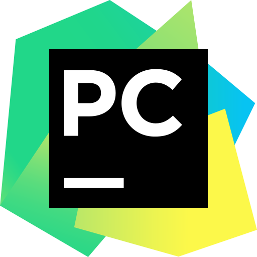

<h1>👋 Welcome! 
My name is 

</h1>

<!--About me-->

<h2>Professional <b>background</b> in a nutshell</h2>
   💼<b>Banking sphere</b> and <b>Trade Finance</b> 
  🤝<b>Project management</b> and experience in <b>team leadership</b> 
  💻<b>QA automation</b> using <i>Java and Python</i> 
  📝<b>Manual testing</b> with tools like <i>Postman</i> 
  📊<b>SQL</b> 
<h2>Tools</h2>

  
<h2>Code and Tasks examples</h2>
   ☑<a href="https://github.com/DenisProkofyev/OpenCartJavaSeleniumTestngAllure">DEMO Project:</a> <b>Java, Selenium, TestNG, Allure</b> for <b>cross-platform and cross-browser</b> testing based on <b>Page Object Model</b> with Jenkins tests execution 
   ✅<b>Java POM</b> Automation: <b>Jenkins</b> 
   ☑<b>Python POM</b> Automation: <b>Magento</b>, <b>Openweather.org</b> 
   ✅<a href="https://github.com/DenisProkofyev/DenisProkofyev/tree/main/userStories">User stories</a> 
   ☑<a href="https://github.com/DenisProkofyev/DenisProkofyev/tree/main/manualTestCases">Test cases</a> 
   ✅Test design techniques 
   ☑<a href="https://github.com/DenisProkofyev/SQL_Examples">SQL queries</a> 
   ✅Postman, JSON, XML 
   ☑Linux commands 
   ✅<a href="https://github.com/DenisProkofyev/LogicTasks">Logic tasks</a>

<h2>Hobbys</h2>
   ⚽ Football and Chess ♟ 
   📖 Languages learning 📬 
   🎸 Music concerts trips 🗺

<!--Stats-->

<h2>Stats</h2>
  

    <b>English Certificate:</b> 
     
     
    
  

<!--

-->

<h2>Contacts</h2>
 

    
    
   
 

<!--
Here are some ideas to get you started:
My revolves around: 
https://magento.softwaretestingboard.com/
- 🔭 I’m currently working on ...
- 🌱 I’m currently learning ...
- 👯 I’m looking to collaborate on ...
- 🤔 I’m looking for help with ...
- 💬 Ask me about ...
- 📫 How to reach me: ...
- 😄 Pronouns: ...
- ⚡ Fun fact: ...
-->
